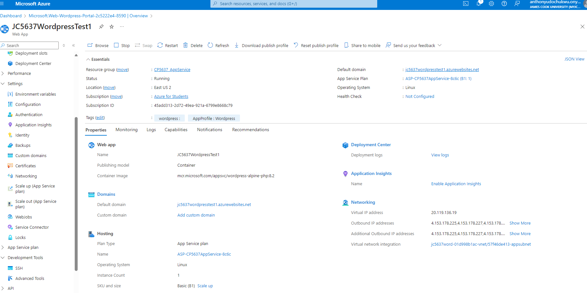
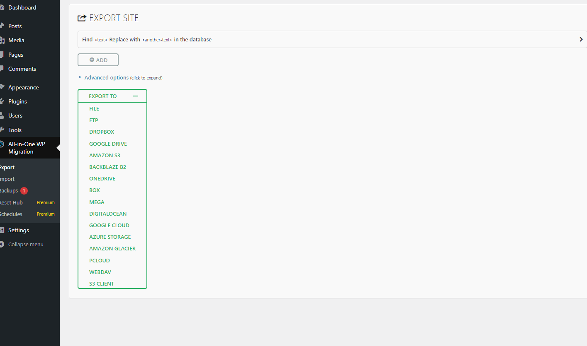
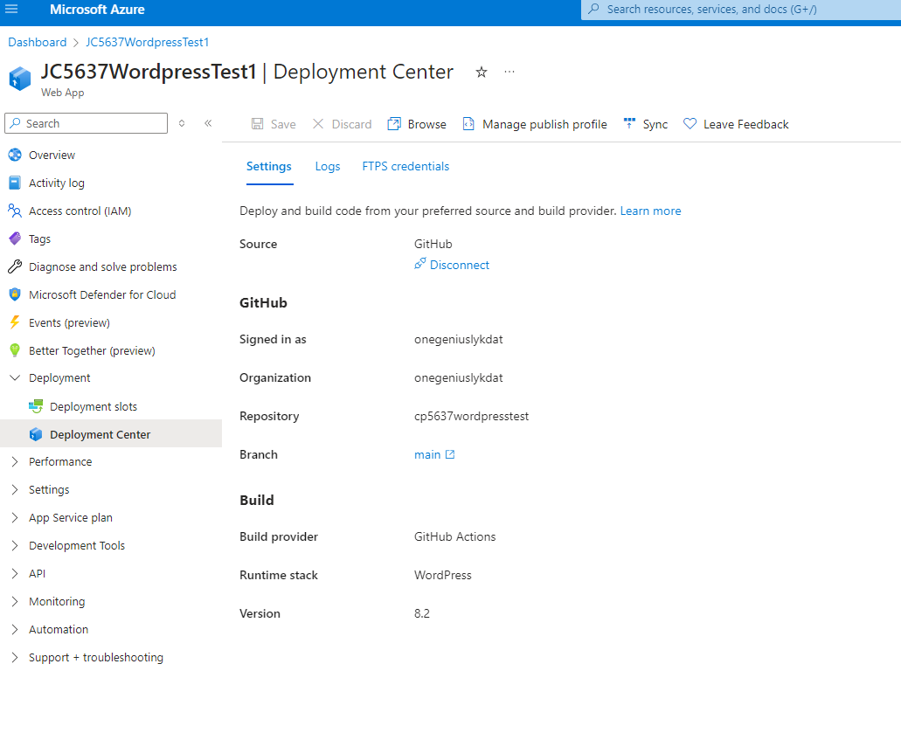
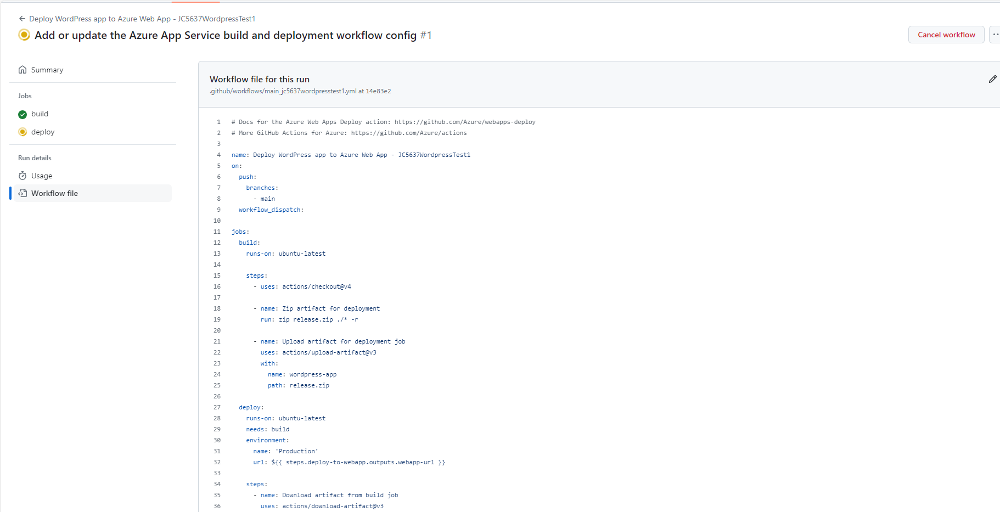

# Week 5
Monday, 17-June-2024 to Saturday, 22-Jun-2024

# Learning Activities & Resources***
This week I learnt about child themes and their importance***
he deployments and development environments. We looked at the standard development environments, consisting of local, staging and production.
* Local environment - using stacks and tools like .Net, iisExpress, XAMP, LAMP, mySQL, SQL-Server, Apache, NG-Inx, etc to develop on your machine. It is often not available online. In the case when a staging environment is not used, a virtual machine which imitates the production environment can be used on the local computer.
* Staging environment - an optional copy of the production environment and available online for ver few. It is typically used to get feedback from a client.
* Production environment - the live environment which end users interact with. Production environments are typically created in Linux servers.

We also looked at deployment workflows. These are systematic and automated processes for moving files and configurations (such as database) from local development environment to staging or production development environments. Good workflows must include version control systems. We also learnt about the linux/unix shell for writing scripts and managing file permissions used in deployment workflows. We were introduced to:
* AWs on Vagrant ([AWS WordPress](https://github.com/lindsaymarkward/awswordpress))
* WordMove ([Wordmove:- Welaika](https://github.com/welaika/wordmove))

# Estimated Hours***
I spent a total of about 6 hours of my own time this week on this subject. On the Monday, Wednesday and Thursday of the following week, I spent 2 hours each day, working on:
* creating a child theme,
* creating my journal.

# Content Insights***
This week's content introduced me to child themes
the standard development environments used in the industry. These are the local environment, staging and production environments. I also learnt about differnet workflows for WordPress, namely:
* AWS on Vagrant
* Wordmove
* WordPress on Azure app Service, which I discovered.

In order to setup workflows with version control, I created a GitHub repository and using the All-In-One WP Migration plugin, I exported my WordPress website into the GitHub repository. Then I created the deployment workflow into my Azure App Service.

# Career/Employability/Learning Insights***
I looked at various options for child themes
having development environments, such as AWS, Wordmove and Azure. I found the Azure platform very easy to use and there were free services available for students. In Azure, I looked at using [Windows Virtual Machines (VM)s](https://learn.microsoft.com/en-us/azure/virtual-machines/windows/quick-create-portal?WT.mc_id=UI_empg) as well as [Linux VMs](https://learn.microsoft.com/en-us/azure/virtual-machines/linux/quick-create-portal?WT.mc_id=UI_empg&tabs=ubuntu) as an environment. I also looked at using [Azure App Service](https://learn.microsoft.com/en-us/azure/app-service/overview?WT.mc_id=APC-AppServices) and I learnt about [WordPress hosting on Azure](https://learn.microsoft.com/en-us/azure/app-service/migrate-wordpress?source=recommendations), using the All-in-One WP Migration plugin on WordPress. I was able to setup my own AppServcie using the WordPress hosting on Azure option.

Below is my configuration dashboard:

I particulary liked the WordPress hosting on Azure, as this exposed me to the linux SSH and I learnt some new commands. It also integrates easily with GitHub in using deployment center, which is essential for workflows. I decided to setup my environment as follows:
* Local - WordPress dashboard
* Production - WordPress on Azure App service

Learning about Wordpress deployment workflows is very helpful. I used the following workflow:
* From WordPress to GitHub: ([Wordpress GitHubRepo](https://github.com/onegeniuslykdat/cp5637wordpresstest))

  
* From GitHub to Azure

Although I have some experience with development, I found setting up these environments very fun. I also enjoyed creating the deployment workflows on Azure and connecting to GitHub for version control. I intend to explore this much more. Overall, I learnt new skills which were impactful for me, as I previously did not know CMS could be used in this manner.
